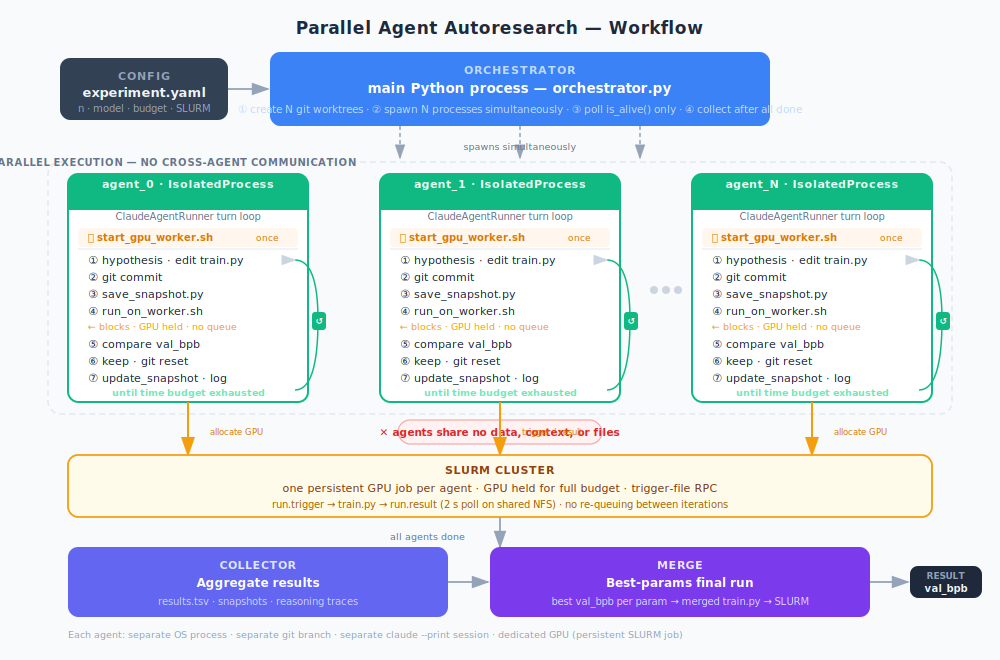

# Agent Parallelization

Parallel agent experiment framework using Claude Code sub-agents to search hyperparameters faster through independent exploration.

## How it works



N independent Claude Code sub-agents run in parallel, each with its own isolated git worktree, GPU allocation, time budget, and output directory. Agents never communicate during the run — they explore the hyperparameter space independently and their best results are merged at the end.

## Modes

| Mode | Command | Description |
|---|---|---|
| Parallel search | `run-parallel` | N independent agents × T budget |
| Single long search | `run-single-long` | 1 agent × 2T budget (control) |
| Capacity benchmark | `python scripts/benchmark_parallel_capacity.py` | Find empirical upper bound on N |
| Merge phase | `python scripts/run_merge_phase.py` | Aggregate best results after parallel search |

## Quick Start

```bash
# Run two parallel agents for 30 minutes each
run-parallel --time-budget 30 --train-budget 360

# Run single agent for 60 minutes (matched budget)
run-single-long --time-budget 30 --train-budget 360

# Find the parallel capacity limit
python scripts/benchmark_parallel_capacity.py --max-n 8

# Merge results from a completed parallel run
python scripts/run_merge_phase.py --experiment-dir runs/experiment_parallel_20260331_120000
```

## Requirements

- Python ≥ 3.10
- Claude Code CLI (`claude`) in PATH
- SLURM cluster with `pi_tpoggio` partition (or local mode with `--no-slurm`)
- `uv` package manager

## Architecture

```
src/agent_parallelization_new/
  config.py              — ExperimentConfig, AgentConfig dataclasses
  orchestrator.py        — launches and monitors sub-agents
  snapshotting.py        — saves train.py snapshots on every change
  reasoning_trace.py     — structured per-step reasoning logs
  resource_benchmark.py  — empirical parallelism upper-bound estimation
  merger.py              — aggregates trajectories into a merged train.py
  budgeting.py           — wall-clock and training-time budget tracking
  agents/                — isolated subprocess runner, Claude CLI wrapper
  outputs/               — schema, collector, evaluator, reporter
  compatibility/         — SLURM training harness, snapshot helper generators
  utils/                 — git worktree management, log parsing
```

## Docs

- [Parallel Capacity](docs/parallel_capacity.md)
- [Merge Protocol](docs/merge_protocol.md)
- [Workflow Diagram](docs/workflow_diagram.md)
