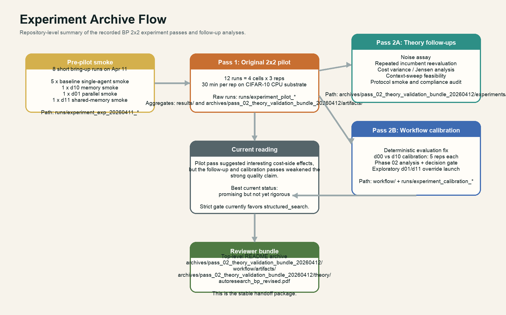
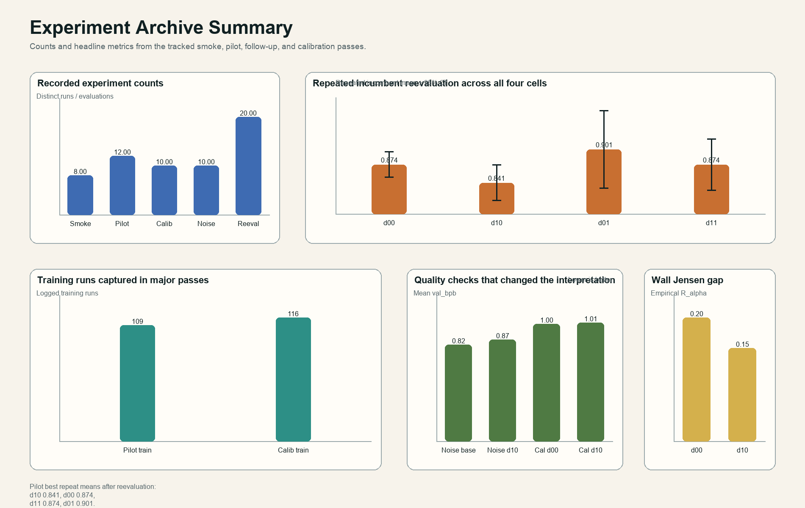
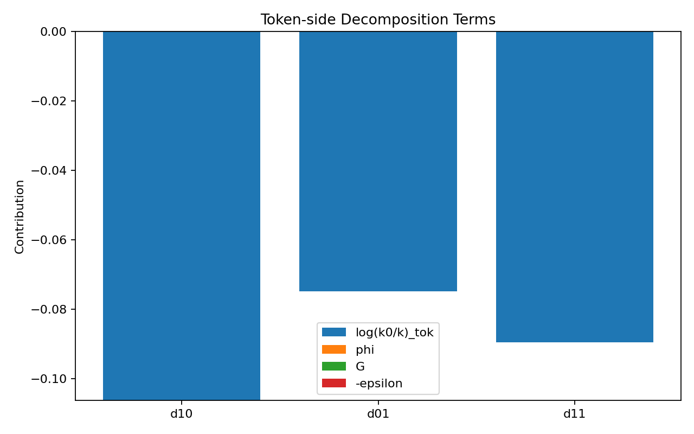

# BP 2x2 Instrumentation on AutoResearch

This repository is the code, experiment archive, and theory bundle for a BP-style decomposition study on autonomous coding agents.

The central research question is whether AutoResearch-style agent architectures can be analyzed through a BP decomposition of the form

```math
\Delta = \log(\kappa_0 / \kappa) + \phi + G - \epsilon
```

under a controlled CPU substrate, deterministic evaluation, structured instrumentation, and post-hoc decomposition analysis.

## Status

As of **April 13, 2026**, the repository contains:

- a complete first AI pass that built the substrate, instrumentation, memory/parallel modes, and original 2x2 pilot;
- a complete second AI pass task queue for theory formalization and protocol repair;
- a full theory-validation bundle in [`archives/pass_02_theory_validation_bundle_20260412/`](archives/pass_02_theory_validation_bundle_20260412/);
- a complete deterministic Phase 02 calibration on `d00` vs `d10`;
- an **ongoing / exploratory** second-pass continuation into `d01` / `d11`.

The current empirical reading remains split:

- the original pilot plus reevaluation still make the framework interesting;
- the stricter calibration gate remains weak and currently points to `structured_search` rather than a clean `proceed`;
- the second pass is therefore best read as **theory-tightening plus exploratory continuation**, not as a final theorem validation.

## AI Task Passes

The repository is now organized around two major AI task passes:

| Pass | Folder | What it owns |
| --- | --- | --- |
| Pass 01 | [`ai_task_passes/pass_01_bp_implementation/`](ai_task_passes/pass_01_bp_implementation/) | initial buildout, instrumentation, substrate, original pilot |
| Pass 02 | [`ai_task_passes/pass_02_theory_formalization/`](ai_task_passes/pass_02_theory_formalization/) | theorem refactor, protocol upgrades, estimator repair, follow-up experiments, reviewer bundle |

Index:

- unified pass index: [`ai_task_passes/README.md`](ai_task_passes/README.md)
- pass 01 task queue: [`ai_task_passes/pass_01_bp_implementation/README.md`](ai_task_passes/pass_01_bp_implementation/README.md)
- pass 02 task queue: [`ai_task_passes/pass_02_theory_formalization/README.md`](ai_task_passes/pass_02_theory_formalization/README.md)
- canonical pass 02 runner: [`ai_task_passes/run_pass_02_theory_formalization.sh`](ai_task_passes/run_pass_02_theory_formalization.sh)

## Experiment Flow

This is the repository-level flow of what has been done so far:



And this is the compact numerical summary of the main experiment families:



## Experimental Design

The core 2x2 design is:

| Cell | Agents | Memory | Intended BP reading |
| --- | --- | --- | --- |
| `d00` | 1 | none | baseline |
| `d10` | 1 | external memory | memory / routing effect |
| `d01` | 2 parallel | none | exploration / `G` effect |
| `d11` | 2 parallel | shared memory | interaction of parallelism and routing |

The current substrate is a **CPU-only CIFAR-10 optimization task**:

- agents may modify [`autoresearch/train.py`](autoresearch/train.py);
- [`autoresearch/prepare.py`](autoresearch/prepare.py) is fixed;
- the target metric is `val_bpb` / validation-loss proxy;
- evaluation was later made deterministic for the calibration workflow;
- turns, training runs, reevaluations, context pressure, and mode labels are logged.

## Experiment Archive

This section is the top-level archive of the experiment families recorded in this repository.

### 0. Pre-pilot smoke and bring-up

These are short validation runs created during the first AI pass to prove that the substrate and all four modes could launch.

| Family | Raw paths | Count | Notes |
| --- | --- | ---: | --- |
| baseline smoke | `runs/experiment_exp_20260411_190921` through `runs/experiment_exp_20260411_194616` | 5 | `single_long`, 10-minute sessions |
| memory smoke | `runs/experiment_exp_20260411_195625` | 1 | `single_memory`, 10-minute session |
| parallel smoke | `runs/experiment_exp_20260411_200635` | 1 | `parallel`, 2 agents |
| shared-memory smoke | `runs/experiment_exp_20260411_201635` | 1 | `parallel_shared`, 2 agents |

These runs belong to **Pass 01** and exist mainly to validate launchability, config routing, and raw artifact creation.

### 1. Pass 01 main experiment: original 2x2 pilot

This is the original 2x2 pilot produced by the first AI pass.

#### Raw pilot runs

| Cell | Raw run directories |
| --- | --- |
| `d00` | `runs/experiment_pilot_d00_rep1` to `runs/experiment_pilot_d00_rep3` |
| `d10` | `runs/experiment_pilot_d10_rep1` to `runs/experiment_pilot_d10_rep3` |
| `d01` | `runs/experiment_pilot_d01_rep1` to `runs/experiment_pilot_d01_rep3` |
| `d11` | `runs/experiment_pilot_d11_rep1` to `runs/experiment_pilot_d11_rep3` |

#### Canonical pass-01 outputs

- pilot summary: [`results/pilot_summary.md`](results/pilot_summary.md)
- raw pilot aggregate: [`results/pilot_raw_data.json`](results/pilot_raw_data.json)
- raw-to-cell mapping: [`runs/pilot_mapping.json`](runs/pilot_mapping.json)
- original pilot decomposition copies:
  [`results/decomposition_rep1.json`](results/decomposition_rep1.json),
  [`results/decomposition_rep2.json`](results/decomposition_rep2.json),
  [`results/decomposition_rep3.json`](results/decomposition_rep3.json)
- original pilot figures:
  [`results/figures/pass_01_pilot/`](results/figures/pass_01_pilot/)

#### Pilot snapshot

| Cell | Mean training runs per rep | Best val_bpb | Total tokens | Mean wall-clock / attempt |
| --- | ---: | ---: | ---: | ---: |
| `d00` | `5.00 +/- 2.94` | `0.81 +/- 0.01` | `40974 +/- 5106` | `136.29s +/- 0.24` |
| `d10` | `5.33 +/- 2.62` | `0.78 +/- 0.03` | `41835 +/- 5007` | `135.78s +/- 0.18` |
| `d01` | `12.67 +/- 3.86` | `0.82 +/- 0.01` | `85060 +/- 10165` | `151.04s +/- 19.89` |
| `d11` | `13.33 +/- 3.30` | `0.80 +/- 0.00` | `75628 +/- 10217` | `137.44s +/- 0.81` |

This pass established the first version of the artifact stack, but the decomposition was still degenerate because `phi`, `G`, and `epsilon` were not yet properly identified.

Pilot figure example:



### 2. Pass 02 theory-validation follow-ups

These are the targeted experiments introduced by the second AI pass after the pilot was judged too optimistic / too weakly identified.

#### Canonical pass-02 experiment folders

| Follow-up experiment | Main path | Purpose |
| --- | --- | --- |
| noise assay | [`archives/pass_02_theory_validation_bundle_20260412/experiments/noise_assay/`](archives/pass_02_theory_validation_bundle_20260412/experiments/noise_assay/) | test verifier noise and best-of-N optimism |
| repeated incumbent means | [`archives/pass_02_theory_validation_bundle_20260412/experiments/followup_01/replicated_means/`](archives/pass_02_theory_validation_bundle_20260412/experiments/followup_01/replicated_means/) | reevaluate selected candidates from all four cells |
| cost variance / Jensen analysis | [`archives/pass_02_theory_validation_bundle_20260412/experiments/followup_01/cost_variance_summary.json`](archives/pass_02_theory_validation_bundle_20260412/experiments/followup_01/cost_variance_summary.json) | quantify Jensen-gap risk |
| context-pressure feasibility | [`archives/pass_02_theory_validation_bundle_20260412/experiments/followup_01/context_sweep_feasibility.json`](archives/pass_02_theory_validation_bundle_20260412/experiments/followup_01/context_sweep_feasibility.json) | test whether H5 is even reachable |
| protocol smoke | [`archives/pass_02_theory_validation_bundle_20260412/artifacts/protocol_smoke/`](archives/pass_02_theory_validation_bundle_20260412/artifacts/protocol_smoke/) | validate upgraded reevaluation / provenance path |

#### Canonical pass-02 summaries

- bundle README: [`archives/pass_02_theory_validation_bundle_20260412/README.md`](archives/pass_02_theory_validation_bundle_20260412/README.md)
- final verdict: [`archives/pass_02_theory_validation_bundle_20260412/analysis/final_verdict.md`](archives/pass_02_theory_validation_bundle_20260412/analysis/final_verdict.md)
- reanalysis summary: [`archives/pass_02_theory_validation_bundle_20260412/analysis/reanalysis_summary.md`](archives/pass_02_theory_validation_bundle_20260412/analysis/reanalysis_summary.md)
- protocol compliance audit: [`archives/pass_02_theory_validation_bundle_20260412/analysis/protocol_compliance_audit.md`](archives/pass_02_theory_validation_bundle_20260412/analysis/protocol_compliance_audit.md)
- revised theory PDF: [`archives/pass_02_theory_validation_bundle_20260412/theory/autoresearch_bp_revised.pdf`](archives/pass_02_theory_validation_bundle_20260412/theory/autoresearch_bp_revised.pdf)

#### Follow-up snapshot

Repeated incumbent reevaluation after protocol upgrades:

| Cell | Mean val_bpb | 95% CI |
| --- | ---: | --- |
| `d00` | `0.8739` | `[0.8512, 0.8967]` |
| `d10` | `0.8412` | `[0.8096, 0.8729]` |
| `d01` | `0.9008` | `[0.8313, 0.9703]` |
| `d11` | `0.8737` | `[0.8280, 0.9194]` |

Noise assay:

| Candidate | Mean val_bpb | Std | Range |
| --- | ---: | ---: | ---: |
| baseline | `0.8246` | `0.0359` | `0.0930` |
| pilot-selected best `d10` | `0.8694` | `0.0501` | `0.1198` |

Jensen-gap summary:

| Cell | Token Jensen gap | Wall Jensen gap |
| --- | ---: | ---: |
| `d00` | `0.0220` | `0.2156` |
| `d10` | `0.0458` | `0.2089` |
| `d01` | `0.0350` | `0.2691` |
| `d11` | `0.0395` | `0.2560` |

Context-pressure feasibility:

| Cell | Current max fill | Multiplier to 50% fill |
| --- | ---: | ---: |
| `d00` | `0.2283` | `2.19x` |
| `d10` | `0.2173` | `2.30x` |
| `d01` | `0.2426` | `2.06x` |
| `d11` | `0.2115` | `2.36x` |

This pass is what changed the interpretation from “pilot looked promising” to “the theorem is cleaner, but the evidence is still not rigorous enough.”

### 3. Pass 02 workflow calibration and current second-pass exploration

The second AI pass also owns the later workflowized calibration and current continuation work under [`workflow/`](workflow/).

`workflow/` is not a third experimental pass. It is the **Pass 02 orchestration layer** that added phase-based calibration, decision gates, prompts, and artifact collection around the second-pass experiments.

#### Workflow phases

The workflow DAG lives under [`workflow/phases/`](workflow/phases/).

| Phase | Purpose | Main output |
| --- | --- | --- |
| `00_overview` | orient the workflow and prerequisites | workflow setup |
| `01_*` | make evaluation deterministic | deterministic substrate |
| `02_power_calibration` | calibrate `d00` vs `d10` | effect size, diversity, cost variance |
| `02a_analyze_calibration` | aggregate calibration evidence | analysis JSON + summary |
| `02b_decision_gate` | choose proceed / extend / structured search | workflow decision |
| `03_*` | full 2x2 continuation and decomposition | currently second-pass exploratory continuation |

#### Raw calibration runs

| Cell | Raw run directories |
| --- | --- |
| `d00` | `runs/experiment_calibration_d00_rep1` to `runs/experiment_calibration_d00_rep5` |
| `d10` | `runs/experiment_calibration_d10_rep1` to `runs/experiment_calibration_d10_rep5` |
| `d01` | currently archived snapshot includes `runs/experiment_calibration_d01_rep1` |
| `d11` | second-pass continuation target, but not yet represented in the stable tracked archive snapshot |

#### Canonical workflow artifacts

- workflow state: [`workflow/state.json`](workflow/state.json)
- descriptive calibration report: [`workflow/artifacts/analysis-report.md`](workflow/artifacts/analysis-report.md)
- strict current calibration JSON: [`workflow/artifacts/calibration_analysis_current.json`](workflow/artifacts/calibration_analysis_current.json)
- run index: [`workflow/artifacts/calibration_runs.json`](workflow/artifacts/calibration_runs.json)
- decision rationale: [`workflow/artifacts/decision_gate_rationale.md`](workflow/artifacts/decision_gate_rationale.md)
- session notes / handoff: [`workflow/artifacts/codex_session_notes.md`](workflow/artifacts/codex_session_notes.md)
- canonical figure pack: [`results/figures/pass_02_workflow_calibration/`](results/figures/pass_02_workflow_calibration/)

#### Calibration snapshot

| Metric | `d00` | `d10` | Reading |
| --- | ---: | ---: | --- |
| best-of-rep mean | `0.8905` | `0.9151` | descriptive view still does not favor `d10` |
| all-runs mean | `1.0026` | `1.0127` | negligible quality gap |
| total runs | `47` | `69` | `d10` iterates faster |
| distinct accepted modes | `3` | `2` | still sparse |
| modes with `>=2` accepted edits | `1` | `1` | theorem identification still weak |
| wall Jensen gap | `0.1962` | `0.1478` | cost regularization signal exists |

Important note:

- `workflow/state.json` still records a `proceed` decision from the descriptive workflow branch;
- the stricter later reanalysis in [`workflow/artifacts/calibration_analysis_current.json`](workflow/artifacts/calibration_analysis_current.json) is the better current reading and points to `structured_search`;
- the `d01` / `d11` continuation should therefore be read as a **second-pass exploratory override**, not as a gate-qualified continuation.

Workflow figure example:


## Pass-to-Experiment / Result Mapping

This table is the main traceability map between AI passes and artifact families.

| Artifact family | AI pass | Why it exists | Canonical locations |
| --- | --- | --- | --- |
| substrate + training target | Pass 01 | create the CPU CIFAR-10 task | [`autoresearch/`](autoresearch/) |
| instrumentation + memory / parallel modes | Pass 01 | make BP-style logging and 2x2 routing possible | [`src/`](src/), [`configs/`](configs/), [`scripts/`](scripts/) |
| smoke bring-up runs | Pass 01 | validate all modes can launch | `runs/experiment_exp_*` |
| original 2x2 pilot | Pass 01 | first end-to-end empirical pass | `runs/experiment_pilot_*`, [`results/`](results/) |
| theorem audits and revised PDF | Pass 02 | tighten the theorem after pilot weaknesses | [`archives/pass_02_theory_validation_bundle_20260412/analysis/`](archives/pass_02_theory_validation_bundle_20260412/analysis/), [`archives/pass_02_theory_validation_bundle_20260412/theory/autoresearch_bp_revised.pdf`](archives/pass_02_theory_validation_bundle_20260412/theory/autoresearch_bp_revised.pdf) |
| protocol / estimator upgrades | Pass 02 | repair logging, reevaluation, and decomposition logic | [`archives/pass_02_theory_validation_bundle_20260412/code/`](archives/pass_02_theory_validation_bundle_20260412/code/), [`scripts/`](scripts/) |
| noise assay and reevaluation | Pass 02 | test selection bias and candidate stability | [`archives/pass_02_theory_validation_bundle_20260412/experiments/`](archives/pass_02_theory_validation_bundle_20260412/experiments/) |
| workflowized calibration | Pass 02 | put calibration and gating on rails | [`workflow/`](workflow/), `runs/experiment_calibration_*` |
| current second-pass continuation | Pass 02 | continue exploration after weak gate evidence | current `workflow/` phase 03 state and archived `runs/experiment_calibration_d01_rep1` snapshot |

## Where To Look

### Core theory bundle

- [`archives/pass_02_theory_validation_bundle_20260412/README.md`](archives/pass_02_theory_validation_bundle_20260412/README.md)
- [`docs/handoffs/NEXT_REVIEWER_START_HERE.md`](docs/handoffs/NEXT_REVIEWER_START_HERE.md)
- revised theory PDF: [`archives/pass_02_theory_validation_bundle_20260412/theory/autoresearch_bp_revised.pdf`](archives/pass_02_theory_validation_bundle_20260412/theory/autoresearch_bp_revised.pdf)
- original theory note: [`archives/pass_02_theory_validation_bundle_20260412/theory/autoresearch_bp.pdf`](archives/pass_02_theory_validation_bundle_20260412/theory/autoresearch_bp.pdf)
- BP source paper: [`archives/pass_02_theory_validation_bundle_20260412/theory/BP.pdf`](archives/pass_02_theory_validation_bundle_20260412/theory/BP.pdf)

### AI task queues

- unified index: [`ai_task_passes/README.md`](ai_task_passes/README.md)
- pass 01 tasks: [`ai_task_passes/pass_01_bp_implementation/`](ai_task_passes/pass_01_bp_implementation/)
- pass 02 tasks: [`ai_task_passes/pass_02_theory_formalization/`](ai_task_passes/pass_02_theory_formalization/)

### Workflow and experiment state

- workflow DAG: [`workflow/phases/`](workflow/phases/)
- workflow scripts: [`workflow/scripts/`](workflow/scripts/)
- workflow state: [`workflow/state.json`](workflow/state.json)
- stable artifacts: [`workflow/artifacts/`](workflow/artifacts/)

### Code paths that matter

- launcher: [`src/agent_parallelization_new/launcher.py`](src/agent_parallelization_new/launcher.py)
- orchestrator: [`src/agent_parallelization_new/orchestrator.py`](src/agent_parallelization_new/orchestrator.py)
- agent runner: [`src/agent_parallelization_new/agents/claude_agent_runner.py`](src/agent_parallelization_new/agents/claude_agent_runner.py)
- mode labeling: [`scripts/label_modes.py`](scripts/label_modes.py)
- decomposition: [`scripts/compute_decomposition.py`](scripts/compute_decomposition.py)

## Repository Map

| Path | What it contains |
| --- | --- |
| [`ai_task_passes/`](ai_task_passes/) | unified archive of the two AI task passes |
| [`autoresearch/`](autoresearch/) | CIFAR-10 CPU substrate and evaluation target |
| [`configs/`](configs/) | launcher and cell configs; see [`configs/README.md`](configs/README.md) |
| [`docs/`](docs/) | guides and handoff notes |
| [`docs/guides/`](docs/guides/) | implementation guide, substrate guide, and pilot protocol moved out of root |
| [`docs/handoffs/`](docs/handoffs/) | reviewer-facing entry points and handoff notes moved out of root |
| [`results/`](results/) | Pass 01 pilot aggregates plus the unified figure archive; see [`results/README.md`](results/README.md) |
| [`runs/`](runs/) | raw smoke, pilot, and calibration experiment directories |
| [`scripts/`](scripts/) | labeling, decomposition, experiment helpers |
| [`src/`](src/) | experiment engine and instrumentation |
| [`archives/pass_02_theory_validation_bundle_20260412/`](archives/pass_02_theory_validation_bundle_20260412/) | self-contained validation and reviewer bundle |
| [`workflow/`](workflow/) | Pass 02 workflow DAG, calibration scripts, prompts, and decision artifacts |

## Notes

- The repository now treats **task passes** as first-class archival structure.
- Pass 01 owns the original implementation and pilot.
- Pass 02 owns the theorem cleanup, targeted follow-ups, workflow calibration, and ongoing second-pass exploration.
- All tracked figures now live under [`results/figures/`](results/figures/) and are split by pass / phase.
- The strict current conclusion is still: **promising but not yet rigorous**.
