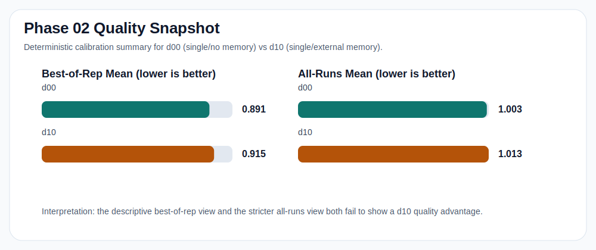
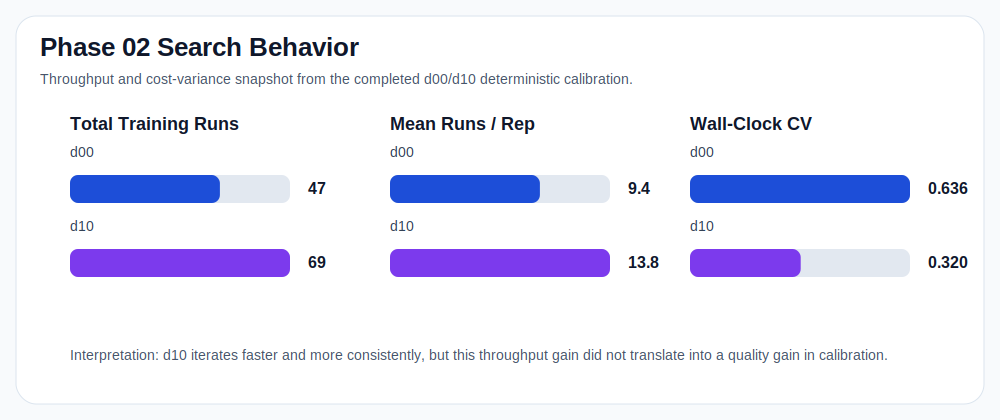
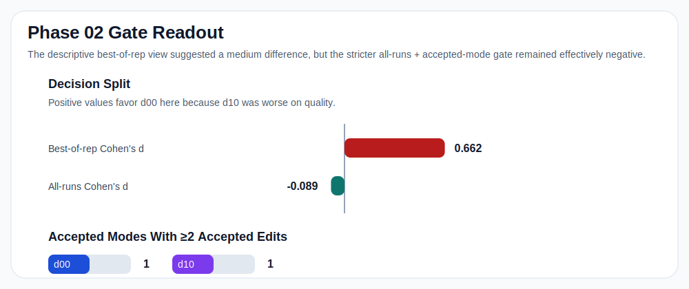

# BP 2×2 Instrumentation on AutoResearch

This repository is the working implementation and evidence bundle for a BP-style decomposition study on autonomous coding agents.

The research question is whether AutoResearch-style agent architectures can be analyzed through the Beneventano-Poggio decomposition

```math
\Delta = \log(\kappa_0 / \kappa) + \phi + G - \epsilon
```

under a controlled CPU substrate, deterministic evaluation, structured instrumentation, and post-hoc decomposition analysis.

## Status

As of **April 13, 2026**, the repository contains:

- a complete **deterministic Phase 02 calibration** on `d00` vs `d10`;
- a full theory-validation bundle in [`theory_validation_bp_20260412/`](theory_validation_bp_20260412/);
- corrected instrumentation, reevaluation logging, and mode-labeling infrastructure;
- an **exploratory** `d01` / `d11` full 2×2 run launched after calibration.

Important: the calibration evidence currently supports a **split interpretation**:

- the descriptive **best-of-rep** view suggests a medium difference, but in the wrong direction for `d10`;
- the stricter **all-runs + accepted-mode** gate remains effectively negative and points to `structured_search` rather than a clean `proceed`.

So the `d01` / `d11` run should be read as a **manual exploratory override**, not as a gate-qualified next phase.

## Experimental Design

The 2×2 design is:

| Cell | Agents | Memory | Intended BP reading |
| --- | --- | --- | --- |
| `d00` | 1 | none | baseline |
| `d10` | 1 | external memory | memory / routing effect |
| `d01` | 2 parallel | none | exploration / `G` effect |
| `d11` | 2 parallel | shared memory | interaction of parallelism and routing |

The current substrate is a **CPU-only CIFAR-10 optimization task**:

- agents may modify [`autoresearch/train.py`](autoresearch/train.py);
- [`autoresearch/prepare.py`](autoresearch/prepare.py) is fixed;
- the optimization target is `val_bpb` / validation loss proxy;
- evaluation was made deterministic before calibration;
- agent turns, training runs, reevaluations, and mode labels are logged.

## Workflow Phases

The workflow DAG lives under [`workflow/phases/`](workflow/phases/).

| Phase | Purpose | Main output |
| --- | --- | --- |
| `00_overview` | orient the workflow and prerequisites | workflow setup |
| `01_*` | make evaluation deterministic | deterministic substrate |
| `02_power_calibration` | calibrate `d00` vs `d10` | effect size, diversity, cost variance |
| `02a_analyze_calibration` | aggregate calibration evidence | analysis JSON + summary |
| `02b_decision_gate` | choose proceed / extend / escalate / structured search | workflow decision |
| `03_*` | full 2×2 experiment and decomposition | `d00/d10/d01/d11` comparison |
| `04_escalation_cifar100` | harder substrate fallback | CIFAR-100 branch |
| `05_structured_search` | structured-search fallback | exact mode mapping |
| `06_theorem_update` | revise theorem from evidence | updated theorem note |
| `07_final_report` | final package / report | handoff-ready bundle |

## Preliminary Results

The stable calibration artifacts are:

- descriptive report: [`workflow/artifacts/analysis-report.md`](workflow/artifacts/analysis-report.md)
- statistical appendix: [`workflow/artifacts/stats-appendix.md`](workflow/artifacts/stats-appendix.md)
- stricter rerun with current labeling: [`workflow/artifacts/calibration_analysis_current.json`](workflow/artifacts/calibration_analysis_current.json)
- workflow gate rationale: [`workflow/artifacts/decision_gate_rationale.md`](workflow/artifacts/decision_gate_rationale.md)

### Calibration Snapshot

| Metric | `d00` | `d10` | Reading |
| --- | ---: | ---: | --- |
| Best-of-rep mean | `0.8905` | `0.9151` | `d10` not better |
| All-runs mean | `1.0026` | `1.0127` | negligible quality gap |
| Total runs | `47` | `69` | `d10` iterates faster |
| Mean runs / rep | `9.4` | `13.8` | throughput advantage for `d10` |
| Modes with `>=2` accepted edits | `1` | `1` | still degenerate for theorem ID |

### Visual Snapshot

#### Quality



#### Search Behavior



#### Decision Split



### Current Read

The most honest current summary is:

- memory improved **iteration throughput**;
- memory did **not** show a convincing quality advantage on calibration;
- accepted-mode structure is still too thin to claim empirical identification of the full `phi + G - epsilon` package;
- the strict gate still favors **structured search** as the clean next step;
- the `d01` / `d11` run is still worth collecting as exploratory evidence.

## Where To Look

### Core theory bundle

- [`theory_validation_bp_20260412/README.md`](theory_validation_bp_20260412/README.md)
- [`NEXT_REVIEWER_START_HERE.md`](NEXT_REVIEWER_START_HERE.md)
- revised theory PDF: [`autoresearch_bp_revised.pdf`](autoresearch_bp_revised.pdf)
- original theory note: [`autoresearch_bp.pdf`](autoresearch_bp.pdf)
- BP source paper: [`BP.pdf`](BP.pdf)

### Workflow and experiment state

- workflow DAG: [`workflow/phases/`](workflow/phases/)
- workflow scripts: [`workflow/scripts/`](workflow/scripts/)
- workflow state: [`workflow/state.json`](workflow/state.json)
- stable artifacts: [`workflow/artifacts/`](workflow/artifacts/)

### Code paths that matter

- launcher: [`src/agent_parallelization_new/launcher.py`](src/agent_parallelization_new/launcher.py)
- orchestrator: [`src/agent_parallelization_new/orchestrator.py`](src/agent_parallelization_new/orchestrator.py)
- agent runner: [`src/agent_parallelization_new/agents/claude_agent_runner.py`](src/agent_parallelization_new/agents/claude_agent_runner.py)
- mode labeling: [`scripts/label_modes.py`](scripts/label_modes.py)
- decomposition: [`scripts/compute_decomposition.py`](scripts/compute_decomposition.py)

### Substrate and configs

- substrate guide: [`CPU_SUBSTRATE_GUIDE.md`](CPU_SUBSTRATE_GUIDE.md)
- implementation guide: [`IMPLEMENTATION_GUIDE.md`](IMPLEMENTATION_GUIDE.md)
- training substrate: [`autoresearch/`](autoresearch/)
- experiment configs: [`configs/`](configs/)

### Generated evidence

- completed runs are under `runs/` locally, but this directory is git-ignored for new experiment outputs;
- stable summary artifacts are intentionally copied into `workflow/artifacts/` and `theory_validation_bp_20260412/`.

## Repository Map

| Path | What it contains |
| --- | --- |
| [`autoresearch/`](autoresearch/) | CIFAR-10 CPU substrate and evaluation target |
| [`configs/`](configs/) | YAML configs for `d00`, `d10`, `d01`, `d11` |
| [`docs/`](docs/) | diagrams, protocol notes, README figures |
| [`scripts/`](scripts/) | labeling, decomposition, experiment helpers |
| [`src/`](src/) | experiment engine and instrumentation |
| [`tasks/`](tasks/) | implementation task queue used for the buildout |
| [`theory_formalization_tasks/`](theory_formalization_tasks/) | later theory-refinement queue and prompt |
| [`theory_validation_bp_20260412/`](theory_validation_bp_20260412/) | self-contained validation and reviewer bundle |
| [`workflow/`](workflow/) | DAG, orchestration helpers, calibration artifacts, decision notes |

## Key Documents

- reviewer handoff: [`NEXT_REVIEWER_START_HERE.md`](NEXT_REVIEWER_START_HERE.md)
- final verdict: [`theory_validation_bp_20260412/analysis/final_verdict.md`](theory_validation_bp_20260412/analysis/final_verdict.md)
- reanalysis summary: [`theory_validation_bp_20260412/analysis/reanalysis_summary.md`](theory_validation_bp_20260412/analysis/reanalysis_summary.md)
- estimator design: [`theory_validation_bp_20260412/analysis/estimator_design.md`](theory_validation_bp_20260412/analysis/estimator_design.md)
- protocol compliance audit: [`theory_validation_bp_20260412/analysis/protocol_compliance_audit.md`](theory_validation_bp_20260412/analysis/protocol_compliance_audit.md)

## Framework CLI

The engine still supports the underlying experiment modes:

```bash
# single control
run-single-long --config configs/experiment_d00.yaml

# single agent with external memory
python workflow/scripts/run_calibration.py --repo-root . --cells d10 --reps 1

# parallel no-sharing
run-parallel --config configs/experiment_d01.yaml

# parallel shared-memory
python -m agent_parallelization_new.launcher --help
```

For the current research workflow, prefer the scripted workflow in [`workflow/`](workflow/) over the older ad hoc commands.

## Notes

- Determinism was a major turning point: without it, the whole decomposition study was dominated by evaluation noise.
- The revised theorem is intentionally narrower than the original note.
- The most useful next milestone remains either:
  - a clean structured-search interface, or
  - a successful `d01` / `d11` exploratory result strong enough to justify revisiting the gate logic.
