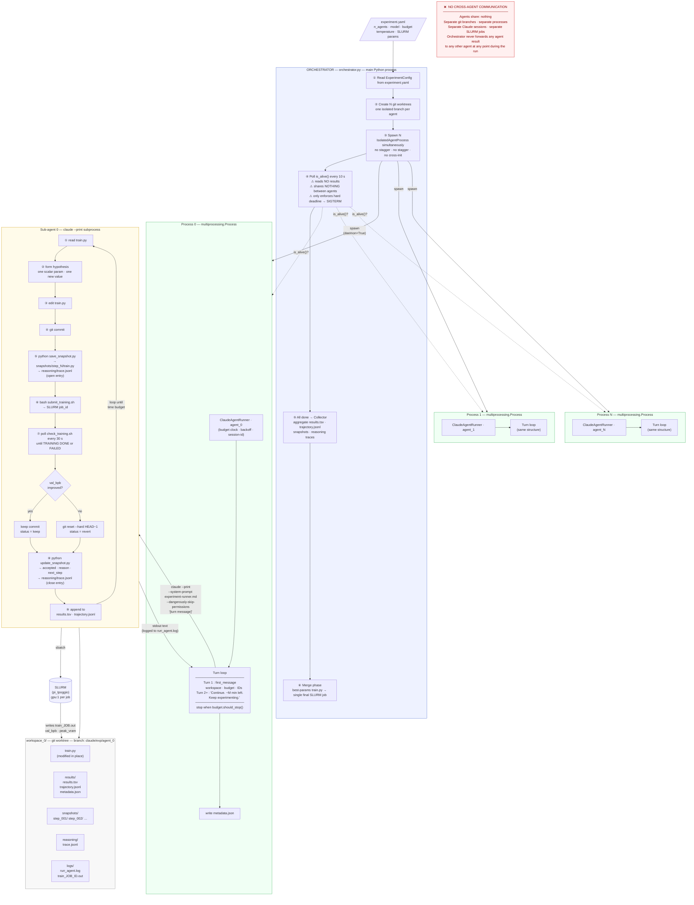
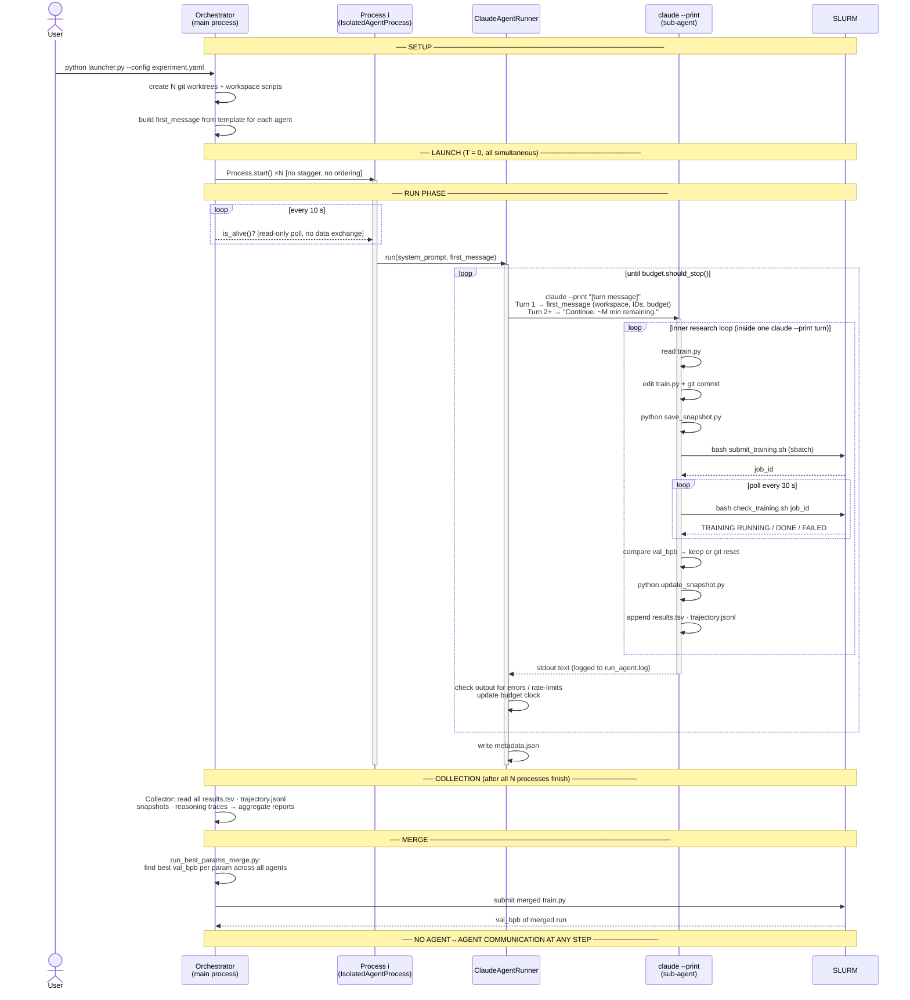

# Parallel Agent Workflow — Architecture Diagrams

---

## 1. System Architecture (N agents)



---

## 2. Communication Map — what talks to what, and when



---

## 3. What the orchestrator controls vs. what it never touches

| Orchestrator **does** | Orchestrator **never does** |
|---|---|
| Creates isolated workspaces (git worktrees) | Reads any agent's `results.tsv` during the run |
| Spawns all processes at the same instant | Passes one agent's val_bpb to another |
| Polls `is_alive()` every 10 s | Modifies any agent's `train.py` |
| Sends SIGTERM at hard deadline (3× budget) | Steers any agent's hypothesis choices |
| Calls Collector **after** all agents finish | Communicates with the claude subprocesses directly |
| Runs the merge phase | Shares reasoning traces between agents during the run |

---

## 4. Isolation guarantees

```
agent_0/workspace/   ←── git branch: claude/EXP/agent_0   ──→  separate git history
agent_1/workspace/   ←── git branch: claude/EXP/agent_1   ──→  separate git history
...
agent_N/workspace/   ←── git branch: claude/EXP/agent_N   ──→  separate git history
         ↑                         ↑                                    ↑
   separate OS process       separate claude --print         separate CUDA_VISIBLE_DEVICES
   (multiprocessing)         subprocess per turn             (no GPU contention)
```

All workspaces share **read-only** symlinks to `data/` and `.venv/` (never written by agents).
